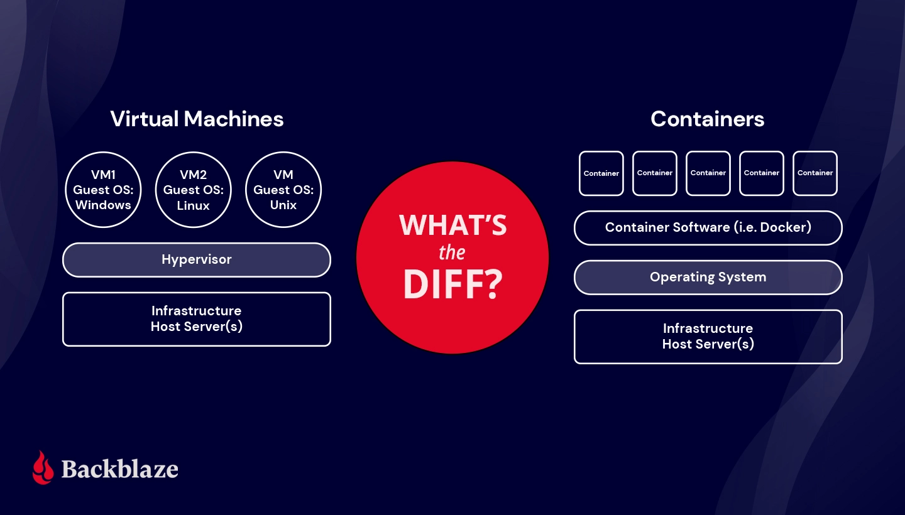

# **INCEPTION 42 PROJECT**

## **- Summary**
> ## **1. Virtualization**
>> ### **1. 1. History Of The Virtualization Concept**
>> ### **1. 2. What Is Virtualization?**
>> ### **1. 3. Problems The Virtualization Solves**
>> ### **1. 4. How Does Virtualization Work?**
>> ### **1. 5. What's Virutal Machine?**
>> ### **1. 5. What Are The Problems Solved By VM?**

> ## **2. Docker**
>> ### **2. 1. What is Docker**
>> ### **2. 2. Docker Components**
>> ### **2. 3. Dockerfile && Docker-compose**
>> ### **2. 4. How Docker works**
>> ### **2. 5. Docker Vs Virtual Machines**
>> ### **2. 6. Advantages of Docker**

## **A - Virutalization**
1. ### **History Of The Virtualization Concept**

The Viratualization Concept was first developed in the 1960s to partition large, mainframe hardware for better hardware utilization, In the early 2000s, VMware introduced its product for x86 servers called ESX Server, and Microsoft acquired virtualization technologies (Virtual PC and an unreleased product) in 2003. The technologies that enabled virtualization were widely adopted in the early 2000s.

2. ### **What Is Virtualization?**

Virtualization is software that creates an abstraction layer over computer hardware, allowing the hardware elements of a single computer to be divided into multiple virtual computers, commonly called virtual machines (VMs). Virtualization makes a single physical machine act like multiple, saving the cost of more servers and workstations. Cloud computing is a service that delivers shared computing resources and is powered by virtualization technology.

3. ### **Problems The Virtualization Solves?**

Virtualization comes to solve several problems, including cost savings, improved efficiency, less downtime, and scalability. It eliminates costs for IT rooms, cables, and hardware. Virtualization also allows IT managers to make changes in one part of a computer system without affecting other parts. However, virtualization can also cause some problems such as VM sprawl, network congestion, server hardware failures, reduced VM performance and security issues.

4. ### **How Does Virtualization Work?**

Virtualization works by using software to simulate hardware functionality and create a virtual computer system. It enables the hardware resources of a single computer to be divided into multiple virtual computers, called virtual machines (VMs). Virtualization allows IT organizations to run more than one virtual system, multiple operating systems, and applications on a single server. This results in economies of scale and greater efficiency. Virtualization is the process of running a virtual instance of a computer system in a layer separate from the actual hardware. It creates useful IT services using resources that are traditionally bound to hardware.

5. ### **What's Virutal Machine?**

A Virtual Machine is a compute resource that uses software instead of a physical computer to run programs and deploy apps. It is a virtual environment that functions as a virtual computer system with its own CPU, memory, network interface, and storage. A VM is a digital version of a physical computer that can run programs and operating systems, store data, connect to networks, and more.

6. ### **What Are The Problems Solved By VM?**

Virtual machines (VMs) solve several problems, including:

- Isolation: VMs allow running multiple independent operating systems on a single physical machine, each with its own isolated environment.

- Resource allocation: VMs allow flexible allocation of hardware resources such as CPU, memory, and storage among different virtual machines.

- Portability: VMs are independent of the underlying hardware and can be easily moved between physical machines.

- Consolidation: VMs allow better utilization of hardware resources by consolidating multiple workloads onto fewer physical machines.

- Testing and development: VMs are useful for testing and development as they allow creating an isolated environment that can be easily created, copied, and deleted.

- Disaster recovery: VMs allow quick and easy recovery from hardware failures or disasters by easily moving VMs to different hardware.

## **B - Docker**
1. ### **What is Docker**
Docker is a software that can package your application, its dependencies, system tools, system libraries and settings in a single comprehensive virtual container. This combined package, which contains everything that’s needed to run your application, is called a Docker container image. This image is a standalone, executable software package which runs reliably on any server — Linux, Windows, macOS, public cloud or private cloud. Also, these images can be used to run the application as an isolated process in user space.

2. ### **Docker Components**
Docker is composed of these five components:
  - Docker Daemon (dockerd)
  - Docker Client
  - Docker Image
  - Docker Container
  - Docker Registry

#### ***What is a Docker Daemon?***
Docker has a client-server architecture. Docker Daemon (dockerd) or server is responsible for all the actions related to containers.

The daemon receives the commands from the Docker client through CLI or REST API. Docker client can be on the same host as a daemon or present on any other host.

By default, the docker daemon listens to the docker.sock UNIX socket. If you have any use case to access the docker API remotely, you need to expose it over a host port. One such use case is running Docker as Jenkins agents.

#### ***What is Docker Client?***
Docker client provides a command-line interface (CLI) that allows users to run, and stop application commands to a Docker daemon.

#### ***What is Docker Image?***
A Docker image is a lightweight, standalone, executable package that contains everything needed to run a piece of software. It is a snapshot of a Docker container, which includes the application code, runtime, system tools, libraries, and settings.

A Docker image is built from a Dockerfile, which is a script that specifies the instructions for building the image. The Dockerfile typically includes a base image, which provides the underlying operating system and runtime environment, as well as additional instructions for installing and configuring software packages, copying files, setting environment variables, and exposing ports.

#### ***What is Docker Container?***
A Docker container is a lightweight and portable executable package that contains an application and all of its dependencies, libraries, and configuration files needed to run.

A container is created from a Docker image, which is a snapshot of the application and environment at a specific point in time. When a container is started, it runs in its own isolated environment, separate from the host system and other containers. The container provides an efficient and consistent runtime environment that ensures the application runs the same way, regardless of where it is deployed.

#### ***What is Docker Registry?***
A Docker registry is a storage and distribution system for Docker images. It allows users to store and share Docker images with other users, either publicly or privately.

Docker Hub is the default public registry for Docker images, providing a large collection of images that can be used as a base for building new images. Docker Hub also allows users to store their own Docker images in private repositories, which can be accessed by authorized users.

3. ### **Dockerfile && Docker-compose**
#### ***What is Dockerfile***
A Dockerfile is a script that automatically creates containers on the Docker platform. A Dockerfile is basically a text document that contains all the commands a user could call on the command line to assemble an image. The Docker platform runs natively on Linux and allows developers to build and run containers, self-contained applications or systems with no dependencies on the underlying infrastructure. Built upon the resource-isolation features of the Linux kernel, Docker helps developers and system administrators port applications across different systems and machines by running them inside containers.

#### ***What is Docker-compose***
Docker Compose is a tool that was developed to help define and share multi-container applications. With Compose, we can create a YAML file to define the services and with a single command, can spin everything up or tear it all down.

4. ### **How Docker Works**
Here's a brief overview of how Docker works:

Developers create a Dockerfile to define an application and its dependencies.
The Dockerfile is used to build a Docker image, which is a packaged version of the application that can run on any system with Docker installed.
The Docker image is stored in a registry, which can be public or private.
Developers can use the Docker image to run a container, which is a lightweight, standalone, and executable package of software.
The Docker container runs in an isolated environment, separate from the host system and other containers, but shares the kernel of the host operating system.
Docker provides tools for managing containers, including starting, stopping, and deleting containers, as well as scaling and distributing applications across multiple hosts.
Docker also provides a network layer that enables containers to communicate with each other and with external services, and a storage layer that allows containers to persist data.
Overall, Docker provides a consistent and portable runtime environment for applications, making it easier to build, deploy, and manage applications at scale.

5. ### **Docker Vs Virtual Machines**

The main difference between virtual machines (VMs) and Docker is that VMs virtualize an entire operating system, including the kernel, whereas Docker virtualizes the application and its dependencies. This means that Docker containers are generally lighter-weight and faster to start up than VMs, since they don't have to boot an entire operating system. Additionally, Docker allows multiple containers to share the same kernel, which can lead to improved performance and resource utilization.

5. ### **Advantages of Docker**
Here are some advantages of Docker:

**Portability**: Docker images are portable, meaning they can be run on any system that has Docker installed. This makes it easy to move applications between different environments, such as development, testing, and production.

**Scalability**: Docker makes it easy to scale applications horizontally by running multiple instances of the same container across multiple hosts. This allows applications to handle increased traffic and demand.

**Consistency**: Docker ensures consistency between development, testing, and production environments by using the same image in each environment. This reduces the risk of errors and improves application quality.

**Isolation**: Docker containers run in an isolated environment, separate from the host system and other containers. This improves security and reduces the risk of conflicts between applications.

**Efficiency**: Docker containers are lightweight and share the host operating system kernel, which makes them more efficient than traditional virtual machines.

**Flexibility**: Docker can be used with a wide range of applications, programming languages, and frameworks. It also integrates with many other tools and technologies.

Overall, Docker simplifies the process of building, deploying, and managing applications by providing a consistent and portable runtime environment that can run on any host system.

### **RESOURCES**

>#### **About Virtualizataion**
  - https://docs.oracle.com/cd/E50245_01/E50249/html/vmcon-intro-virt-history.html
  - https://www.ibm.com/topics/virtualization
  - https://www.vmware.com/solutions/virtualization.html
  - https://azure.microsoft.com/en-au/resources/cloud-computing-dictionary/what-is-a-virtual-machine/

>#### **About Docker**
  - https://docs.docker.com/get-started/overview/
  - https://docs.docker.com/get-started/ (Very Important To Know How To Work With Docker)

>#### **Nginx**
  - https://nginx.org/en/docs/beginners_guide.html
  - https://www.freecodecamp.org/news/the-nginx-handbook/

>#### **WordPress**

>#### **MariaDB**

>#### Bonus

