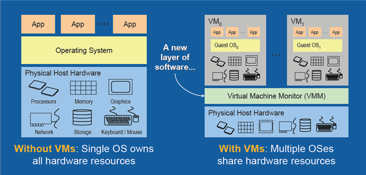
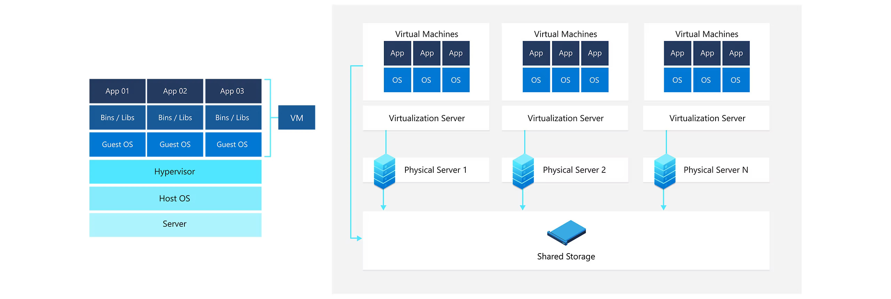

# **INCEPTION 42 PROJECT**

## **- Summary**
> ## **1. Virtualization**
>> ### **1. 1. History Of The Virtualization Concept**
>> ### **1. 2. What Is Virtualization?**
>> ### **1. 3. Problems The Virtualization Solves**
>> ### **1. 4. How Does Virtualization Work?**
>> ### **1. 5. What's Virutal Machine?**
>> ### **1. 5. What Are The Problems Solved By VM?**

> ## **2. Docker**
>> ### **2. 1. What is Docker**
>> ### **2. 2. Docker Components**
>> ### **2. 3. How Docker works**
>> ### **2. 4. Advantages of Docker**

## **A - Virutalization**
1. ### **History Of The Virtualization Concept**

The Viratualization Concept was first developed in the 1960s to partition large, mainframe hardware for better hardware utilization, In the early 2000s, VMware introduced its product for x86 servers called ESX Server, and Microsoft acquired virtualization technologies (Virtual PC and an unreleased product) in 2003. The technologies that enabled virtualization were widely adopted in the early 2000s.

2. ### **What Is Virtualization?**

Virtualization is software that creates an abstraction layer over computer hardware, allowing the hardware elements of a single computer to be divided into multiple virtual computers, commonly called virtual machines (VMs). Virtualization makes a single physical machine act like multiple, saving the cost of more servers and workstations. Cloud computing is a service that delivers shared computing resources and is powered by virtualization technology.

3. ### **Problems The Virtualization Solves?**

Virtualization comes to solve several problems, including cost savings, improved efficiency, less downtime, and scalability. It eliminates costs for IT rooms, cables, and hardware. Virtualization also allows IT managers to make changes in one part of a computer system without affecting other parts. However, virtualization can also cause some problems such as VM sprawl, network congestion, server hardware failures, reduced VM performance and security issues.

4. ### **How Does Virtualization Work?**

Virtualization works by using software to simulate hardware functionality and create a virtual computer system. It enables the hardware resources of a single computer to be divided into multiple virtual computers, called virtual machines (VMs). Virtualization allows IT organizations to run more than one virtual system, multiple operating systems, and applications on a single server. This results in economies of scale and greater efficiency. Virtualization is the process of running a virtual instance of a computer system in a layer separate from the actual hardware. It creates useful IT services using resources that are traditionally bound to hardware.

5. ### **What's Virutal Machine?**

A Virtual Machine is a compute resource that uses software instead of a physical computer to run programs and deploy apps. It is a virtual environment that functions as a virtual computer system with its own CPU, memory, network interface, and storage. A VM is a digital version of a physical computer that can run programs and operating systems, store data, connect to networks, and more.

6. ### **What Are The Problems Solved By VM?**

Virtual machines (VMs) solve several problems, including:

- Isolation: VMs allow running multiple independent operating systems on a single physical machine, each with its own isolated environment.

- Resource allocation: VMs allow flexible allocation of hardware resources such as CPU, memory, and storage among different virtual machines.

- Portability: VMs are independent of the underlying hardware and can be easily moved between physical machines.

- Consolidation: VMs allow better utilization of hardware resources by consolidating multiple workloads onto fewer physical machines.

- Testing and development: VMs are useful for testing and development as they allow creating an isolated environment that can be easily created, copied, and deleted.

- Disaster recovery: VMs allow quick and easy recovery from hardware failures or disasters by easily moving VMs to different hardware.

## **A - Docker**
1. ### **What is Docker**
Docker is an open platform for developing, shipping, and running applications. Docker enables you to separate your applications from your infrastructure so you can deliver software quickly. With Docker, you can manage your infrastructure in the same ways you manage your applications. By taking advantage of Docker’s methodologies for shipping, testing, and deploying code quickly, you can significantly reduce the delay between writing code and running it in production.

2. ### **Docker Components**
Docker is composed of these five components:
  - Docker Daemon (dockerd)
  - Docker Client
  - Docker Image
  - Docker Container
  - Docker Registry

#### **What is a Docker Daemon?**
Docker has a client-server architecture. Docker Daemon (dockerd) or server is responsible for all the actions related to containers.

The daemon receives the commands from the Docker client through CLI or REST API. Docker client can be on the same host as a daemon or present on any other host.

By default, the docker daemon listens to the docker.sock UNIX socket. If you have any use case to access the docker API remotely, you need to expose it over a host port. One such use case is running Docker as Jenkins agents.

#### **What is Docker Client?**
Docker client provides a command-line interface (CLI) that allows users to run, and stop application commands to a Docker daemon.

### **RESOURCES**

>#### **About Virtualizataion**
  - https://docs.oracle.com/cd/E50245_01/E50249/html/vmcon-intro-virt-history.html
  - https://www.ibm.com/topics/virtualization
  - https://www.vmware.com/solutions/virtualization.html
  - https://azure.microsoft.com/en-au/resources/cloud-computing-dictionary/what-is-a-virtual-machine/

>#### **About Docker**
  - https://docs.docker.com/get-started/overview/
  - https://docs.docker.com/get-started/ (Very Important To Know How To Work With Docker)

>#### **Nginx**
  - https://nginx.org/en/docs/beginners_guide.html

>#### **WordPress**

>#### **MariaDB**

>#### Bonus

